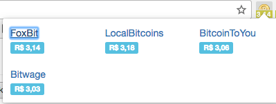

## BTCBRL Chrome Extension



This extension shows the current value of BTCBRL (buy) / BTCUSD (sell) from different exchanges (Default FoxBit).

## Install

```
$ npm install
$ bower install
```

*Requires [Node.js](https://nodejs.org) 6.5.0+*

## Usage

Build:

```
$ gulp build
```

Package:

```
$ gulp package
```

Livereload:

```
$ gulp watch
```

## Issues

The current `gulp package` command doesn't append all the background scripts such as jQuery.

## License

MIT (c) Kalnee. See [LICENSE](https://github.com/kalnee/btcbrl/blob/master/LICENSE.md) for details.
